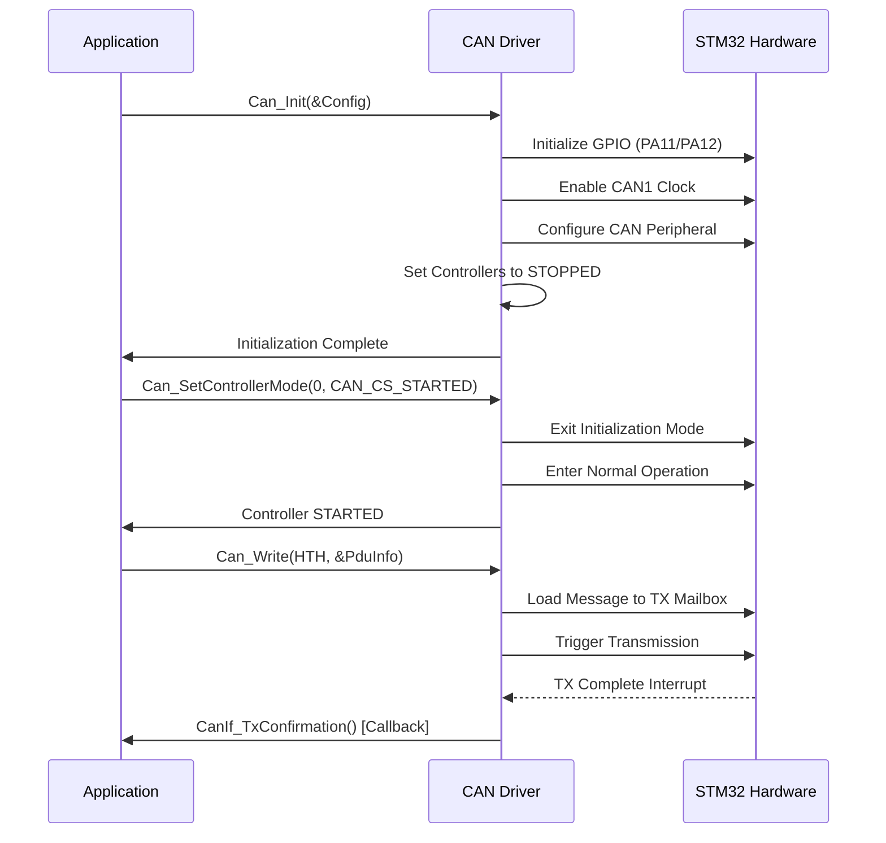

# AUTOSAR CAN Driver Documentation

## Table of Contents

1. [Overview](#overview)
2. [CAN Driver Architecture](#can-driver-architecture)
3. [Workflow and State Machine](#workflow-and-state-machine)
4. [Function Documentation](#function-documentation)
5. [Configuration Parameters](#configuration-parameters)
6. [Data Types and Structures](#data-types-and-structures)
7. [Usage Examples](#usage-examples)
8. [Hardware Mapping](#hardware-mapping)
9. [Error Handling](#error-handling)
10. [Best Practices](#best-practices)

---

## Overview

The AUTOSAR CAN Driver provides a standardized interface for Controller Area Network (CAN) communication on STM32F103C8T6 microcontroller. This implementation follows AUTOSAR Classic platform specification and provides:

- **Hardware Abstraction**: Abstract interface to CAN hardware
- **AUTOSAR Compliance**: Following SWS_Can specifications
- **STM32F103 Optimization**: Optimized for STM32F103C8T6 CAN peripheral
- **Error Detection**: Comprehensive error detection and reporting
- **Interrupt/Polling Support**: Configurable processing modes

### Key Features

✅ **AUTOSAR 4.4 Compliant**  
✅ **STM32F103C8T6 Hardware Support**  
✅ **Development Error Detection (DET)**  
✅ **Multiple Baudrate Support (125k, 250k, 500k, 1Mbps)**  
✅ **Interrupt and Polling Modes**  
✅ **Comprehensive State Management**  
✅ **Hardware Filter Support**

---

## CAN Driver Architecture

### Layer Structure

```
┌─────────────────────────┐
│   Application Layer     │
├─────────────────────────┤
│      CanIf Layer        │ ← Interface between upper layers and CAN Driver
├─────────────────────────┤
│    CAN Driver (MCAL)    │ ← This Implementation
├─────────────────────────┤
│   STM32F103 Hardware    │
└─────────────────────────┘
```

### Module Dependencies

```
Can.h
├── Can_Types.h     (Type definitions)
├── Can_Cfg.h       (Configuration parameters)
├── Std_Types.h     (AUTOSAR standard types)
├── Det.h           (Development Error Tracer - optional)
└── STM32 SPL       (Hardware abstraction)
    ├── stm32f10x.h
    ├── stm32f10x_can.h
    ├── stm32f10x_rcc.h
    └── stm32f10x_gpio.h
```

### File Organization

| File | Purpose | Description |
|------|---------|-------------|
| `Can.h` | Public Interface | Function prototypes and public definitions |
| `Can.c` | Implementation | Core CAN driver functionality |
| `Can_Types.h` | Type Definitions | AUTOSAR-compliant data types |
| `Can_Cfg.h` | Configuration Header | Compile-time configuration parameters |
| `Can_Cfg.c` | Configuration Data | Runtime configuration structures |

---

## Workflow and State Machine

### CAN Controller State Machine

```
                    ┌─────────────┐
                    │   UNINIT    │ ← Initial state after reset
                    └──────┬──────┘
                           │ Can_Init()
                           ▼
    ┌──────────────────────────────────────────────┐
    │                 STOPPED                      │ ← After initialization
    └─────┬────────────────────────────────┬───────┘
          │ Can_SetControllerMode()        │ Can_SetControllerMode()
          │ (CAN_CS_STARTED)               │ (CAN_CS_SLEEP)
          ▼                                ▼
    ┌─────────────┐                  ┌─────────────┐
    │   STARTED   │ ◄────────────────┤    SLEEP    │
    └─────────────┘  Can_SetControllerMode()   └─────────────┘
                     (CAN_CS_STARTED)
```

### Driver Initialization Workflow



### Message Transmission Flow

```
Application
    ↓ Can_Write(Hth, PduInfo)
CAN Driver
    ↓ Validate Parameters
    ↓ Check Controller State
    ↓ Find Free TX Mailbox
    ↓ Load Message Data
    ↓ Trigger Transmission
STM32 Hardware
    ↓ Send on CAN Bus
    ↓ Generate TX Complete Interrupt
CAN Driver
    ↓ TX Confirmation Processing
    ↓ CanIf_TxConfirmation(PduId) [Callback]
Upper Layer
```

### Message Reception Flow

```
CAN Bus Message
    ↓ Received by STM32
STM32 Hardware
    ↓ Filter Check
    ↓ Store in RX FIFO
    ↓ Generate RX Interrupt
CAN Driver
    ↓ Read from FIFO
    ↓ Extract Message Data
    ↓ CanIf_RxIndication() [Callback]
Upper Layer
```

---

## Function Documentation

### Services Affecting Complete Hardware Unit

#### `Can_Init()`

**Prototype:**
```c
void Can_Init(const Can_ConfigType* Config);
```

**Purpose:** Initializes the CAN Hardware Units and Controllers according to the configuration.

**Parameters:**
- `Config` (in): Pointer to driver configuration structure

**Behavior:**
1. Validates configuration pointer (if DET enabled)
2. Stores configuration reference
3. Initializes GPIO pins for CAN communication
4. Enables CAN peripheral clocks
5. Sets all controllers to STOPPED state
6. Initializes runtime data structures
7. Configures hardware filters (basic setup)

**Hardware Actions:**
- **GPIO Configuration**: PA11 (CAN_RX) as input, PA12 (CAN_TX) as alternate function
- **Clock Enable**: RCC_APB1Periph_CAN1 enable
- **Register Setup**: Basic CAN peripheral initialization

**Usage Example:**
```c
// Initialize CAN driver with default configuration
Can_Init(&Can_Config);
```

#### `Can_DeInit()`

**Prototype:**
```c
void Can_DeInit(void);
```

**Purpose:** De-initializes the CAN driver and resets all controllers to UNINIT state.

**Parameters:** None

**Behavior:**
1. Checks if driver is initialized (if DET enabled)
2. Sets all controllers to STOPPED state first
3. Resets all controllers to UNINIT state
4. Clears driver initialization flag
5. Releases configuration pointer

#### `Can_GetVersionInfo()`

**Prototype:**
```c
void Can_GetVersionInfo(Std_VersionInfoType* versioninfo);
```

**Purpose:** Returns version information of the CAN driver module.

**Parameters:**
- `versioninfo` (out): Pointer to store version information

**Returned Information:**
- Vendor ID: 0x0001
- Module ID: 0x007B (CAN module)
- SW Version: 1.0.0

---

### Services Affecting Single CAN Controller

#### `Can_SetControllerMode()`

**Prototype:**
```c
Std_ReturnType Can_SetControllerMode(uint8 Controller, Can_ControllerStateType Transition);
```

**Purpose:** Changes the CAN controller operational mode.

**Parameters:**
- `Controller` (in): CAN controller ID (0 for CAN1)
- `Transition` (in): Requested state transition

**Return Values:**
- `E_OK`: Mode change successful
- `E_NOT_OK`: Mode change failed

**Supported Transitions:**
- `CAN_CS_STARTED`: Enter normal operation mode
- `CAN_CS_STOPPED`: Enter initialization/stopped mode  
- `CAN_CS_SLEEP`: Enter sleep mode for power saving

**State Transition Matrix:**

| From State | To State | Hardware Action | Valid |
|------------|----------|-----------------|-------|
| STOPPED | STARTED | Clear INRQ bit, wait for INAK=0 | ✅ |
| STARTED | STOPPED | Set INRQ bit, wait for INAK=1 | ✅ |
| STOPPED | SLEEP | Set SLEEP bit, wait for SLAK=1 | ✅ |
| SLEEP | STOPPED | Clear SLEEP bit, wait for SLAK=0 | ✅ |
| Others | Any | - | ❌ |

**Implementation Details:**
```c
// Example: Start controller
if (Transition == CAN_CS_STARTED) {
    CanPtr->MCR &= ~CAN_MCR_INRQ;  // Clear initialization request
    // Wait for hardware acknowledgment with timeout
    while (((CanPtr->MSR & CAN_MSR_INAK) == CAN_MSR_INAK) && (TimeoutCounter < CAN_MODE_CHANGE_TIMEOUT)) {
        TimeoutCounter++;
    }
}
```

#### `Can_SetBaudrate()`

**Prototype:**
```c
Std_ReturnType Can_SetBaudrate(uint8 Controller, uint16 BaudRateConfigID);
```

**Purpose:** Configures the baudrate of the CAN controller.

**Parameters:**
- `Controller` (in): CAN controller ID
- `BaudRateConfigID` (in): Baudrate configuration identifier

**Supported Baudrates:**
- `CAN_BAUDRATE_125KBPS_ID` (0): 125 kbps
- `CAN_BAUDRATE_250KBPS_ID` (1): 250 kbps  
- `CAN_BAUDRATE_500KBPS_ID` (2): 500 kbps
- `CAN_BAUDRATE_1MBPS_ID` (3): 1 Mbps

**Timing Calculations (36MHz CAN Clock):**
```c
// 250kbps example: (36MHz / (1 + 13 + 2) / 9) = 250kbps
Prescaler = 9;
SJW = CAN_SJW_1tq;      // Synchronization Jump Width: 1 time quantum
BS1 = CAN_BS1_13tq;     // Bit Segment 1: 13 time quanta
BS2 = CAN_BS2_2tq;      // Bit Segment 2: 2 time quanta
// Total: 1 + 13 + 2 = 16 time quanta per bit
```

**Usage Notes:**
- Controller must be in STOPPED state
- Configuration takes effect immediately
- Timing parameters are pre-calculated for stability

#### `Can_DisableControllerInterrupts()` / `Can_EnableControllerInterrupts()`

**Prototypes:**
```c
void Can_DisableControllerInterrupts(uint8 Controller);
void Can_EnableControllerInterrupts(uint8 Controller);
```

**Purpose:** Enable/disable CAN controller interrupts for critical sections.

**Managed Interrupts:**
- `CAN_IT_TME`: Transmit mailbox empty
- `CAN_IT_FMP0`: FIFO 0 message pending  
- `CAN_IT_FMP1`: FIFO 1 message pending
- `CAN_IT_BOF`: Bus-off condition
- `CAN_IT_EPV`: Error passive state
- `CAN_IT_EWG`: Error warning

**Implementation:**
```c
// Enable interrupts
CanPtr->IER = CAN_IT_TME | CAN_IT_FMP0 | CAN_IT_FMP1 | CAN_IT_BOF | CAN_IT_EPV | CAN_IT_EWG;

// Disable interrupts  
CanPtr->IER = 0;
```

---

### Services Affecting Hardware Handles

#### `Can_Write()`

**Prototype:**
```c
Std_ReturnType Can_Write(Can_HwHandleType Hth, const Can_PduType* PduInfo);
```

**Purpose:** Transmits a CAN message via the specified hardware transmit handle.

**Parameters:**
- `Hth` (in): Hardware Transmit Handle (0-2 for STM32F103)
- `PduInfo` (in): Pointer to PDU information structure

**PduInfo Structure:**
```c
typedef struct {
    PduIdType   swPduHandle;    // Software PDU handle for confirmation
    uint8       length;         // Data Length Code (0-8)
    Can_IdType  id;            // CAN identifier (11/29-bit)
    uint8*      sdu;           // Pointer to data payload
} Can_PduType;
```

**Return Values:**
- `E_OK`: Transmission request accepted
- `E_NOT_OK`: Development error occurred
- `CAN_BUSY`: No free TX mailbox available

**CAN ID Format:**
```
Standard Frame (11-bit ID):
┌─────────────────────┬─────────────────────┐
│    Reserved (21)    │     ID (11)         │
│   bits 31-11        │   bits 10-0         │  
└─────────────────────┴─────────────────────┘

Extended Frame (29-bit ID):
┌─────┬───────────────────────────────────┐
│Type │           ID (29)                 │
│(2)  │         bits 28-0                 │
└─────┴───────────────────────────────────┘
Type: 00=Standard, 10=Extended
```

**Transmission Process:**
1. **Parameter Validation**: Check pointers, DLC, controller state
2. **Mailbox Selection**: Find available TX mailbox (0-2)
3. **Message Preparation**: Format STM32 CanTxMsg structure
4. **Hardware Loading**: Load message into selected mailbox
5. **Transmission Trigger**: Set transmission request bit
6. **Status Return**: Return success/busy/error status

**Code Example:**
```c
// Prepare message data
uint8 txData[8] = {0x01, 0x02, 0x03, 0x04, 0x05, 0x06, 0x07, 0x08};

// Prepare PDU
Can_PduType pdu = {
    .swPduHandle = 0x100,           // PDU ID for confirmation
    .length = 8,                    // 8 bytes data
    .id = 0x123,                   // Standard CAN ID
    .sdu = txData                  // Data pointer
};

// Transmit message
Std_ReturnType result = Can_Write(CAN_HTH_0, &pdu);
if (result == E_OK) {
    // Message queued for transmission
} else if (result == CAN_BUSY) {
    // Retry later - no free mailbox
}
```

---

### Scheduled Functions (Polling Mode)

#### `Can_MainFunction_Write()`

**Purpose:** Polls for TX confirmation when `CAN_TX_PROCESSING == POLLING`.

**Behavior:**
1. Iterate through all active controllers
2. Check TX mailbox status registers
3. Process completed transmissions
4. Call `CanIf_TxConfirmation()` for completed messages

#### `Can_MainFunction_Read()`

**Purpose:** Polls for RX messages when `CAN_RX_PROCESSING == POLLING`.

**Behavior:**
1. Check RX FIFO message pending status
2. Read messages from FIFO 0 and FIFO 1
3. Extract message data and ID
4. Call `CanIf_RxIndication()` for received messages

#### `Can_MainFunction_BusOff()`

**Purpose:** Polls for bus-off recovery when `CAN_BUSOFF_PROCESSING == POLLING`.

**Behavior:**
1. Monitor error status register (ESR)
2. Detect bus-off condition (BOFF bit)
3. Update controller error state
4. Call `CanIf_ControllerBusOff()` notification

---

## Configuration Parameters

### Compile-Time Configuration (`Can_Cfg.h`)

#### API Configuration Switches

| Parameter | Type | Default | Description |
|-----------|------|---------|-------------|
| `CAN_DEV_ERROR_DETECT` | boolean | STD_ON | Enable/disable DET error reporting |
| `CAN_VERSION_INFO_API` | boolean | STD_ON | Enable/disable `Can_GetVersionInfo()` |
| `CAN_DEINIT_API` | boolean | STD_ON | Enable/disable `Can_DeInit()` |
| `CAN_SET_BAUDRATE_API` | boolean | STD_ON | Enable/disable `Can_SetBaudrate()` |

#### Processing Configuration

| Parameter | Values | Default | Description |
|-----------|--------|---------|-------------|
| `CAN_TX_PROCESSING` | INTERRUPT/POLLING | INTERRUPT | TX confirmation processing mode |
| `CAN_RX_PROCESSING` | INTERRUPT/POLLING | INTERRUPT | RX indication processing mode |
| `CAN_BUSOFF_PROCESSING` | INTERRUPT/POLLING | INTERRUPT | Bus-off recovery processing mode |

#### Hardware Limits

| Parameter | Value | Description |
|-----------|-------|-------------|
| `CAN_MAX_CONTROLLERS` | 1 | Number of CAN controllers (CAN1 only) |
| `CAN_MAX_HTH_OBJECTS` | 3 | TX mailboxes available |
| `CAN_MAX_HRH_OBJECTS` | 2 | RX FIFOs available |
| `CAN_CLOCK_FREQUENCY` | 36000000 | CAN peripheral clock (Hz) |

### Runtime Configuration (`Can_Cfg.c`)

#### Controller Configuration Structure

```c
typedef struct {
    uint8 CanControllerId;              // Controller ID (0)
    uint32 CanControllerBaseAddress;    // Hardware base address
    uint16 CanControllerDefaultBaudrate; // Default baudrate config ID
    boolean CanControllerActivation;    // Enable/disable controller
    
    // Interrupt configuration
    uint8 CanRxProcessing;              // RX processing mode
    uint8 CanTxProcessing;              // TX processing mode
    uint8 CanBusOffProcessing;          // Bus-off processing mode
    
    // Hardware object references
    Can_HwObjectConfigType* CanHwObjectConfig; // HW objects array
    uint8 CanHwObjectCount;             // Number of HW objects
} Can_ControllerConfigType;
```

#### Hardware Object Configuration

```c
typedef struct {
    Can_HwHandleType CanObjectId;       // Hardware handle ID
    Can_ObjectTypeType CanObjectType;   // TRANSMIT/RECEIVE
    uint8 CanControllerRef;             // Controller reference
    
    // For TX objects
    Can_IdType CanIdMask;               // ID filter mask
    Can_IdType CanIdValue;              // ID filter value
    
    // For RX objects  
    uint8 CanFifoRef;                   // FIFO reference (0/1)
    uint8 CanFilterRef;                 // Filter reference
} Can_HwObjectConfigType;
```

---

## Data Types and Structures

### Controller States

```c
typedef enum {
    CAN_CS_UNINIT  = 0x00,    // Controller uninitialized
    CAN_CS_STARTED = 0x01,    // Controller in normal operation
    CAN_CS_STOPPED = 0x02,    // Controller stopped/initialization mode
    CAN_CS_SLEEP   = 0x03     // Controller in sleep mode
} Can_ControllerStateType;
```

### Error States

```c
typedef enum {
    CAN_ERRORSTATE_ACTIVE,     // Normal operation, can send error frames
    CAN_ERRORSTATE_PASSIVE,    // Limited operation, cannot send active error frames  
    CAN_ERRORSTATE_BUSOFF      // Disconnected from bus, no communication
} Can_ErrorStateType;
```

### Message Structure

```c
typedef struct {
    PduIdType   swPduHandle;    // Software PDU handle (0-65535)
    uint8       length;         // Data length (0-8 bytes)
    Can_IdType  id;            // CAN identifier with frame type info
    uint8*      sdu;           // Pointer to 8-byte data array
} Can_PduType;
```

### Hardware Information

```c
typedef struct {
    Can_IdType          CanId;         // Received CAN ID
    Can_HwHandleType    Hoh;           // Hardware Object Handle
    uint8               ControllerId;   // Controller that received message
} Can_HwType;
```

---

## Usage Examples

### Basic Initialization and Transmission

```c
#include "Can.h"
#include "Can_Cfg.h"

void CAN_Example_Basic(void)
{
    Std_ReturnType result;
    uint8 txBuffer[8] = {0xAA, 0xBB, 0xCC, 0xDD, 0xEE, 0xFF, 0x11, 0x22};
    
    // 1. Initialize CAN driver
    Can_Init(&Can_Config);
    
    // 2. Start CAN controller
    result = Can_SetControllerMode(0, CAN_CS_STARTED);
    if (result != E_OK) {
        // Handle controller start error
        return;
    }
    
    // 3. Prepare and send message
    Can_PduType txPdu = {
        .swPduHandle = 0x200,
        .length = 8,
        .id = 0x123,  // Standard 11-bit ID
        .sdu = txBuffer
    };
    
    result = Can_Write(CAN_HTH_0, &txPdu);
    switch (result) {
        case E_OK:
            // Message queued successfully
            break;
        case CAN_BUSY:
            // No free mailbox, retry later
            break;
        case E_NOT_OK:
            // Parameter or state error
            break;
    }
}
```

### Extended Frame Transmission

```c
void CAN_Example_ExtendedFrame(void)
{
    uint8 data[4] = {0x01, 0x02, 0x03, 0x04};
    
    Can_PduType extendedPdu = {
        .swPduHandle = 0x300,
        .length = 4,
        .id = 0x12345678 | 0x80000000,  // Extended ID with type bits
        .sdu = data
    };
    
    Std_ReturnType result = Can_Write(CAN_HTH_1, &extendedPdu);
    // Handle result...
}
```

### Baudrate Configuration

```c
void CAN_Example_SetBaudrate(void)
{
    // Must be in STOPPED state to change baudrate
    Can_SetControllerMode(0, CAN_CS_STOPPED);
    
    // Set to 500kbps
    Std_ReturnType result = Can_SetBaudrate(0, CAN_BAUDRATE_500KBPS_ID);
    if (result == E_OK) {
        // Baudrate configured successfully
        Can_SetControllerMode(0, CAN_CS_STARTED);
    }
}
```

### Polling Mode Operation

```c
void CAN_Example_PollingMode(void)
{
    // Main application loop with polling
    while (1) {
        // Poll for TX confirmations
        Can_MainFunction_Write();
        
        // Poll for RX indications  
        Can_MainFunction_Read();
        
        // Poll for bus-off events
        Can_MainFunction_BusOff();
        
        // Application delay
        HAL_Delay(1);
    }
}
```

### Error Handling Example

```c
void CAN_Example_ErrorHandling(void)
{
    Can_ErrorStateType errorState;
    uint8 rxErrorCounter, txErrorCounter;
    
    // Get controller error state
    Std_ReturnType result = Can_GetControllerErrorState(0, &errorState);
    if (result == E_OK) {
        switch (errorState) {
            case CAN_ERRORSTATE_ACTIVE:
                // Normal operation
                break;
            case CAN_ERRORSTATE_PASSIVE:
                // Warning level - reduce traffic
                break;
            case CAN_ERRORSTATE_BUSOFF:
                // Critical error - restart controller
                Can_SetControllerMode(0, CAN_CS_STOPPED);
                // Wait for recovery...
                Can_SetControllerMode(0, CAN_CS_STARTED);
                break;
        }
    }
    
    // Get error counters for diagnostics
    Can_GetControllerRxErrorCounter(0, &rxErrorCounter);
    Can_GetControllerTxErrorCounter(0, &txErrorCounter);
}
```

---

## Hardware Mapping

### STM32F103C8T6 CAN Peripheral Mapping

#### GPIO Configuration

| Signal | Pin | Configuration | Description |
|--------|-----|---------------|-------------|
| CAN1_RX | PA11 | Input Pull-up | CAN receive signal |
| CAN1_TX | PA12 | Alternate Function Push-Pull | CAN transmit signal |

#### Clock Configuration

```c
// Enable GPIO and CAN clocks
RCC_APB2PeriphClockCmd(RCC_APB2Periph_GPIOA, ENABLE);  // GPIO clock
RCC_APB1PeriphClockCmd(RCC_APB1Periph_CAN1, ENABLE);   // CAN1 clock

// CAN clock source: APB1 = 36MHz (at 72MHz system clock)
```

#### Hardware Resources

| Resource | STM32F103 | Usage |
|----------|-----------|-------|
| TX Mailboxes | 3 | Hardware transmit buffers |
| RX FIFOs | 2 | Hardware receive buffers (3 messages each) |
| Filters | 14 | Message acceptance filters |
| Interrupts | 4 | TX, RX0, RX1, SCE (Status Change Error) |

### Memory Map

| Register Set | Base Address | Description |
|--------------|--------------|-------------|
| CAN1 | 0x40006400 | CAN1 control and status registers |
| Filters | 0x40006600 | CAN filter registers (shared) |

### Interrupt Vectors

| Interrupt | Vector | Priority | Description |
|-----------|---------|----------|-------------|
| CAN1_TX | 19 | 5 | Transmit mailbox empty |
| CAN1_RX0 | 20 | 5 | FIFO 0 message pending |
| CAN1_RX1 | 21 | 5 | FIFO 1 message pending |
| CAN1_SCE | 22 | 5 | Status change error |

---

## Error Handling

### Development Error Detection (DET)

When `CAN_DEV_ERROR_DETECT == STD_ON`, the driver reports errors to the DET module:

#### Common DET Errors

| Error Code | Name | Description | API |
|------------|------|-------------|-----|
| 0x01 | CAN_E_PARAM_POINTER | NULL pointer parameter | All APIs with pointer parameters |
| 0x02 | CAN_E_PARAM_HANDLE | Invalid hardware handle | Can_Write |
| 0x03 | CAN_E_PARAM_DLC | Invalid data length (>8) | Can_Write |
| 0x04 | CAN_E_PARAM_CONTROLLER | Invalid controller ID | Controller-specific APIs |
| 0x05 | CAN_E_UNINIT | Driver not initialized | All APIs except Can_Init |
| 0x06 | CAN_E_TRANSITION | Invalid state transition | Can_SetControllerMode |

#### DET Error Example

```c
// Invalid controller ID triggers DET error
Std_ReturnType result = Can_SetControllerMode(99, CAN_CS_STARTED);
// DET Report: Module=0x007B, Instance=0x00, API=0x03, Error=0x04
```

### Runtime Error Handling

#### Controller Error States

The CAN controller monitors bus errors and transitions between error states:

```
Error Counter < 96     ┌─────────────────┐
   ────────────────────┤      ACTIVE     ├─────────────────────
                       └─────────────────┘                    │
                                                              │
Error Counter ≥ 96     ┌─────────────────┐                    │ Error Counter < 96
   ────────────────────┤     PASSIVE     ├──────────────────────
                       └─────────────────┘                    
                                                              
Transmit Error > 255   ┌─────────────────┐                    
   ────────────────────┤     BUS-OFF     │                    
                       └─────────────────┘                    
```

#### Error Counter Monitoring

```c
void MonitorCANErrors(void)
{
    uint8 rxErrors, txErrors;
    Can_ErrorStateType state;
    
    // Get current error counters
    Can_GetControllerRxErrorCounter(0, &rxErrors);
    Can_GetControllerTxErrorCounter(0, &txErrors);
    Can_GetControllerErrorState(0, &state);
    
    // Check for error conditions
    if (state == CAN_ERRORSTATE_PASSIVE) {
        // Reduce message transmission rate
        MessageInterval *= 2;
    } else if (state == CAN_ERRORSTATE_BUSOFF) {
        // Attempt bus-off recovery
        RecoverFromBusOff();
    }
}

void RecoverFromBusOff(void)
{
    // Reset controller to clear bus-off
    Can_SetControllerMode(0, CAN_CS_STOPPED);
    
    // Wait for bus recovery (11 consecutive recessive bits)
    HAL_Delay(10);
    
    // Restart controller
    Can_SetControllerMode(0, CAN_CS_STARTED);
}
```

### Hardware Error Detection

The STM32 CAN peripheral provides detailed error information:

```c
typedef enum {
    CAN_ERROR_BIT_MONITORING1      = 0x01,  // Dominant expected, recessive read
    CAN_ERROR_BIT_MONITORING0      = 0x02,  // Recessive expected, dominant read  
    CAN_ERROR_CHECK_ACK_FAILED     = 0x04,  // No acknowledgment received
    CAN_ERROR_ARBITRATION_LOST     = 0x06,  // Lost arbitration during transmission
    CAN_ERROR_CHECK_CRC_FAILED     = 0x0A,  // CRC check failed
    CAN_ERROR_BUS_LOCK             = 0x0B   // Bus stuck at dominant level
} Can_ErrorType;
```

---

## Best Practices

### 1. Initialization Sequence

```c
✅ Correct Initialization Order:
1. Can_Init(&Config)           // Initialize driver
2. Configure filters (optional) // Set message acceptance
3. Can_SetControllerMode()     // Start controller  
4. Enable interrupts           // Allow message processing

❌ Common Mistakes:
- Calling Can_Write() before Can_SetControllerMode()
- Not checking return values
- Missing DET error handling
```

### 2. Message Transmission

```c
✅ Good Practice:
// Always check return status
Std_ReturnType result = Can_Write(HTH, &pdu);
if (result == CAN_BUSY) {
    // Implement retry mechanism or queue message
    ScheduleRetry(&pdu);
} else if (result == E_NOT_OK) {
    // Handle parameter or state error
    HandleError();
}

❌ Avoid:
Can_Write(HTH, &pdu);  // Ignoring return value
```

### 3. Error Handling

```c
✅ Proactive Error Monitoring:
void MainLoop(void) {
    // Regular error state checking
    if (++errorCheckCounter >= ERROR_CHECK_INTERVAL) {
        CheckControllerErrors();
        errorCheckCounter = 0;
    }
    
    // Normal message processing
    ProcessCANMessages();
}

✅ Graceful Bus-Off Recovery:
void HandleBusOff(void) {
    // Log the event
    LogError("CAN Bus-Off detected");
    
    // Stop transmission attempts
    DisableTransmission();
    
    // Attempt recovery with backoff
    ScheduleBusOffRecovery();
}
```

### 4. Filter Configuration

```c
✅ Efficient Filter Setup:
// Accept specific ID ranges instead of all messages
CAN_FilterInitStructure.CAN_FilterIdHigh = 0x100 << 5;      // Base ID
CAN_FilterInitStructure.CAN_FilterMaskIdHigh = 0x700 << 5;  // Mask for range
// This accepts IDs 0x100-0x17F

❌ Inefficient:
// Accepting all messages increases CPU load
CAN_FilterInitStructure.CAN_FilterMaskIdHigh = 0x0000;  // Accept all
```

### 5. Interrupt vs. Polling

```c
✅ Choose Based on Requirements:

// High-performance, low-latency applications
#define CAN_TX_PROCESSING    INTERRUPT
#define CAN_RX_PROCESSING    INTERRUPT

// Simple applications with main loop processing  
#define CAN_TX_PROCESSING    POLLING
#define CAN_RX_PROCESSING    POLLING

// Mixed mode for balanced performance
#define CAN_TX_PROCESSING    INTERRUPT    // Fast TX confirmation
#define CAN_RX_PROCESSING    POLLING      // Controlled RX processing
```

### 6. Memory Management

```c
✅ Proper Buffer Management:
// Use static buffers for message data
static uint8 TxBuffer[MAX_MESSAGES][8];
static Can_PduType TxQueue[MAX_MESSAGES];

// Avoid dynamic allocation in embedded systems
❌ uint8* buffer = malloc(8);  // Not recommended
```

### 7. Performance Optimization

```c
✅ Minimize Interrupt Duration:
void CAN_RX_IRQHandler(void) {
    // Quick processing in interrupt
    if (CAN_GetITStatus(CAN1, CAN_IT_FMP0)) {
        // Set flag for main loop processing
        rxMessagePending = TRUE;
        CAN_ClearITPendingBit(CAN1, CAN_IT_FMP0);
    }
}

// Detailed processing in main loop
void ProcessRxMessages(void) {
    if (rxMessagePending) {
        // Read and process messages
        while (CAN_MessagePending(CAN1, CAN_FIFO0)) {
            ReadAndProcessMessage();
        }
        rxMessagePending = FALSE;
    }
}
```

---

## Conclusion

This AUTOSAR CAN driver provides a robust, standards-compliant interface for CAN communication on STM32F103C8T6. Key benefits include:

- **AUTOSAR Compliance**: Ensures portability and standardization
- **Comprehensive Error Handling**: Robust error detection and recovery
- **Flexible Configuration**: Supports various operating modes and baudrates
- **Hardware Optimization**: Efficient use of STM32F103 CAN peripheral
- **Documentation**: Complete API documentation and usage examples

For additional information, refer to:
- AUTOSAR CAN Driver Specification (SWS_Can)
- STM32F103 Reference Manual
- CAN Bus Protocol Specification (ISO 11898)

---

**Document Version**: 1.0  
**Last Updated**: August 24, 2025  
**Author**: hoangphuc540202@gmail.com
